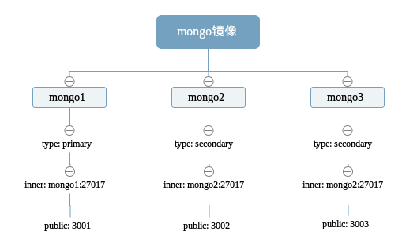

## 准备

这里唯一需要的安装的软件就是 docker, 当然文末也提供了`docker-compose.yml`文件可以通过 docker-compose up 方便的一键运行复制集集群。基于 docker, 我们甚至不需要本地安装 mongodb, 所有的 mongodb 实例均运行在 docker 容器里面。

* 安装 docker, 参考[官方文档](https://docs.docker.com/engine/getstarted/step_one/), 也可以通过阿里云镜像快速安装

```
curl -sSL http://acs-public-mirror.oss-cn-hangzhou.aliyuncs.com/docker-engine/internet | sh -＃ 阿里云镜像快速安装

docker -v # 打印 docker 版本以确保安装正确
```

* 拉取官方 mongo 镜像

```
docker pull mongo　＃拉取最新版本
docker pull mongo:3.2 ＃拉取 mongo 版本为 3.2
```

## 总览

我们将从 mongo 镜像运行 3 个容器 mongo1,mongo2,mongo3。这三个容器需要网络互通，它们将作为实例组合成一个 mongo 集群。其中 mongo1 作为 primary 实例，暴露端口 3001。mongo2 和 mongo3 均作为 sencodary 实例，分别对外暴露端口 3002,3003。



## 设置网络

创建名为 mongo_repset 的网络
```
docker network create mongo_replset
```
查看网络是否创建成功
```
docker network ls | grep mongo_replset
```

## 设置数据卷
如果没有数据卷，数据会随着容器的销毁而丢失，所以我们需要设置一个空间用来存储 mongo 产生的数据，所以创建如下数据卷

```
docker volume create mongo1
docker volume create mongo2
docker volume create mongo3
```

## 运行镜像

首先启动作为 primary 实例的容器
```
docker run -p 3001:27017 --name mongo1 -v mongo1:/data/db --net mongo_replset mongo mongod --replSet mongo-repl-set
```
命令解释如下：

* `docker run`: 运行容器
* `-p 3001:27017`: 暴露端口 27017 到内部网络，暴露 3001 到外部网络
* `--name mongo1`: 设置容器名为 mongo1, 容器名同时作为域名暴露给内部网络，所以内部网络中可以通过 mongo1:27017 访问服务
* `-v mongo1`: 挂载数据卷 mongo1 到容器的 /data/db 路径，mongo 默认将所有数据存储到 /data/db
* `--net mongo_replset`: 容器运行在 mongo_replset 网络里
* `mongo`: 镜像
* `mongod --replSet mongo-repl-set`: 运行 mongod 实例并将实例添加到 mongo-repl-set 复制集

再启动作为 secondary 复制集的容器
```
docker run -p 3002:27017 --name mongo2 -v mongo2:/data/db --net mongo_replset mongo mongod --replSet mongo-repl-set

docker run -p 3003:27017 --name mongo3 -v mongo3:/data/db --net mongo_replset mongo mongod --replSet mongo-repl-set
```
因为所有实例都加入了 mongo_replset 网路，所以各实例可以互相 ping 通
```
docker exec -it mongo1 ping -c 3 mongo2

PING mongo2 (10.0.0.8): 56 data bytes
64 bytes from 10.0.0.8: icmp_seq=0 ttl=64 time=0.028 ms
64 bytes from 10.0.0.8: icmp_seq=1 ttl=64 time=0.138 ms
--- m2 ping statistics ---
2 packets transmitted, 2 packets received, 0% packet loss
round-trip min/avg/max/stddev = 0.028/0.083/0.138/0.055 ms

docker exec -it mongo1 ping -c 3 mongo3
docker exec -it mongo2 ping -c 3 mongo1
```


## 设置复制集

上面我们设置并运行了 mongo 实例，现在我们将它们组合成复制集集群

选择一个容器并运行
```
docker exec -it mongo1 mongo
```
上述命令会带我们进入 mongo shell，在 mongo shell 中运行
```
> db = (new Mongo('localhost:27017')).getDB('test')
test
> rs.initiate({
    "_id": "mongo-repl-set",
    "members": [
        {
            "_id": 0,
            "host": "mongo1:27017"
        },
        {
            "_id": 1,
            "host": "mongo2:27017"
        },
        {
            "_id": 2,
            "host": "mongo3:27017"
        }
    ]
  })

{ "ok": 1 }
```
`rs.initiate`调用的是一个配置对象，其_id 字段传入复制集名，也就是前面运行容器是选项`replSet`的值。members 传入加入到复制集实例。

我们退出 mongo shell 后再次进入，可以看到 mongo shell 的提示符已经变为
```
mongo-repl-set:PRIMARY>
```
如果是从 mongo2 或者 mongo3 进入，可以看到提示符为
```
mongo-repl-set:SECONDARY>
```

## 测试验证

进入 primary 的 mongo shell
```
docker exec -it mongo1 mongo
```
插入一条数据
```
mongo-repl-set:PRIMARY> db.mycoll.insert({name: 'sample'})
WriteResult({ "nInserted" : 1 })
mongo-repl-set:PRIMARY> db.mycoll.find()
{ "_id" : ObjectId("58c77fff35df208f17c3ad89"), "name" : "sample" }
```
退出后进入 secondary 的 mongo shell
```
mongo-repl-set:SECONDARY> use test
switched to db test
mongo-repl-set:SECONDARY> db.setSlaveOk()
mongo-repl-set:SECONDARY> db.mycoll.find()
{ "_id" : ObjectId("58c77fff35df208f17c3ad89"), "name" : "sample" }
```
`db.setSlaveOk`很关键，代表允许连接读取非 primary 实例数据，没有设置进行查询时报错
```
mongo-repl-set:SECONDARY> db.mycoll.find()
Error: error: {
        "ok" : 0,
        "errmsg" : "not master and slaveOk=false",
        "code" : 13435,
        "codeName" : "NotMasterNoSlaveOk"
}
```

## docker-compose 复制集

尽管通过 docker 我们已经很方便的运行了一个复制集集群，但是我们还可以通过 docker-compose 启动整个集群

* 编写`docker-compose.yml`

```
version: "2"
services:

   mongo1:
    image: 'mongo'
    ports:
      - 3001:27017
    volumes:
      - mongo1:/data/db
    command: bash -c "mongod --replSet mongo-repl-set && mongo --eval 'rs.initiate({\"_id\":\"mongo-repl-set\",\"members\":[{\"_id\":0,\"host\":\"mongo1:27017\"},{\"_id\":1,\"host\":\"mongo2:27017\"},{\"_id\":2,\"host\":\"mongo3:27017\"}]})'"
    depends_on:
      - mongo2
      - mongo3

  mongo2:
    image: 'mongo'
    ports:
      - 3002:27017
    volumes:
      - mongo2:/data/db
    command: mongod --replSet mongo-repl-set

  mongo3:
    image: 'mongo'
    ports:
      - 3003:27017
    volumes:
      - mongo3:/data/db
    command: mongod --replSet mongo-repl-set

volumes:
  mongo1:
  mongo2:
  mongo3:

```

* 启动集群
```
docker-compose up -d
```

## 总结

通过 docker, 我们很简单就搭建了一个 mongo 复制集集群。用来作为本地测试是完全没问题的，但是如果要运用到生产环境，还需注意如下几点

* mongo 不添加任何参数，默认是没有权限验证的，运行到生产环境是需添加用户角色权限

* 实例均运行在一个机器上并不是一个好主意，可以通过 [docker swarm](https://docs.docker.com/engine/swarm/) 搭建集群
