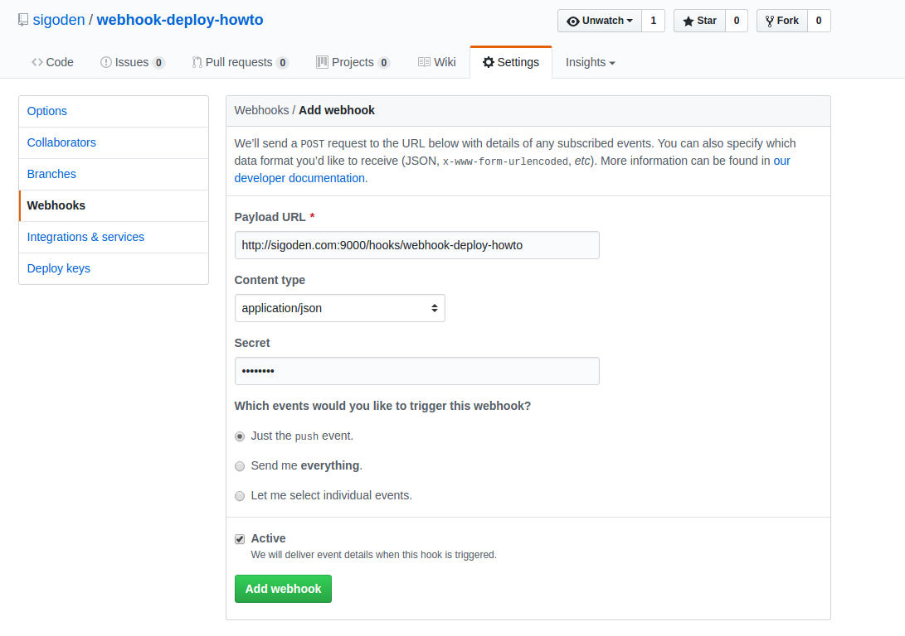

## WEBHOOK 介绍

Webhook 允许第三方应用监听 WEB 服务中的特定事件，在这些事件发生时通过 HTTP POST 方式通知 ( 超时 5 秒） 到第三方应用指定的 Web URL。 例如项目有新的内容 Push，或是 Merge Request 有更新等。 WebHook 可方便用户实现自动部署，自动测试，自动打包，监控项目变化等。 且最近已被广泛使用。各大 git 服务 github,gitlab,bitbucket, 以及 ci 服务 circle, jenkins 等均提供了 webhook 接口, 可以利用它将一些作业自动化。

下面介绍如何做到 git push 一下，线上代码自动更新了。 


## 发送方配置

webhook 的发送方配置无非是设置第三方 Web URL， 选择触发动作的事件，有些允许设置秘钥以确保数据安全性和完整性。下面已 Github 进行举例

Settings > Webhooks > Add webhook 下添加一条记录




* Payload URL: 当事件发生时 github 将向该地址以 HTTP POST 的方式发送数据
* Content-Type: POST 数据格式，可以为 JSON 或者 x-www-form-urlencoded
* Secret: 安全秘钥，github 使用 SHA-256 算法和此秘钥对需要发送的数据进行加密，生成加密串填充到 X-Hub-Signature HTTP 头中，发送给 Payload URL。
* Active: 是否启用

## 接收方配置

Webhook 需要一个发送方和一个接收方。我们需要一个 Web Server 对推送来的 webhook 进行处理解析。自己实现一个也并不麻烦，但我们生存在一个开源的世界，有的是轮子供我们选择，下面我们将使用 [webhook-cli](https://www.npmjs.com/package/webhook-cli)

### 安装

```bash
npm i -g webhook-cli
```

### 配置 hooks.json

```json
[
  {
    "id": "webhook-deploy-howto",
    "execute-command": "/tmp/webhook-deploy-howto/auto.sh",
    "include-command-output-in-response": true,
    "trigger-rule":
    {
      "and":
      [
        {
          "match":
          {
            "type": "payload-hash-sha1",
            "secret": "mysecret",
            "parameter":
            {
              "source": "header",
              "name": "X-Hub-Signature"
            }
          }
        },
        {
          "match":
          {
            "type": "value",
            "value": "refs/heads/master",
            "parameter":
            {
              "source": "payload",
              "name": "ref"
            }
          }
        }
      ]
    }
  }
]
```

- id: 监听 webhook 事件名，与 Payload URL 对应
- execute-command: 当 webhook 触发并校验通过后，执行的脚本路径
- trigger-rule: 对 webhook 进行校验，上例对签名和提交的分支进行的校验，其中 secret 值与 github 的 Secret 文本框中填写的值对应


### 运行

```
webhook-cli --hooks hooks.json --verbose
```
服务启动后，将监听`0.0.0.0:9000`, 并处理 POST 到 /hooks/webhook-deploy-howto 的请求

这样当进行了一次 git 提交，git 会向我们`server:9000/hooks/webhook-deploy-howto`发送一条 HTTP POST 请求，webhook-cli 接受到请求后，对数据进行有效性验证。

如果请求合法，则会运行`/tmp/webhook-deploy-howto/auto.sh`，我们可以在该脚本中拉取最新的代码，运行测试，将代码更新到正式服务器等，完成整个自动化流程。

## 结论

webhook 是一种事件模型，我们在在发送方注册事件，在接收方处理事件。这种方式使我们能够安全灵活的使用各种独立的服务完成各种复杂任务。可以自动测试，自动部署，也可以发送短信，邮件... 更多玩法还是自己去钻研吧
