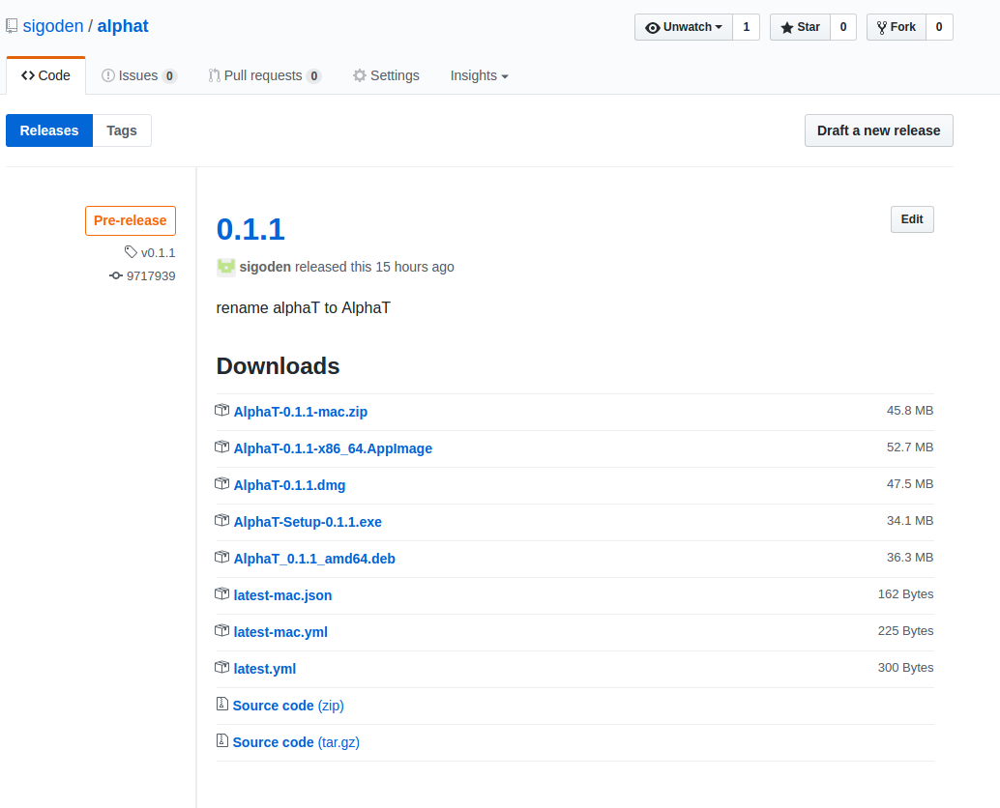
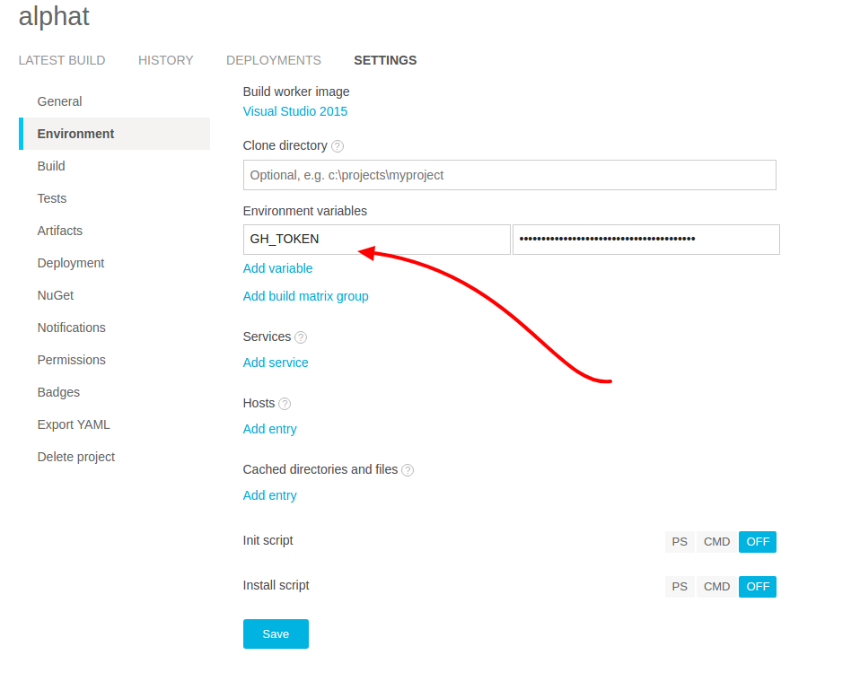
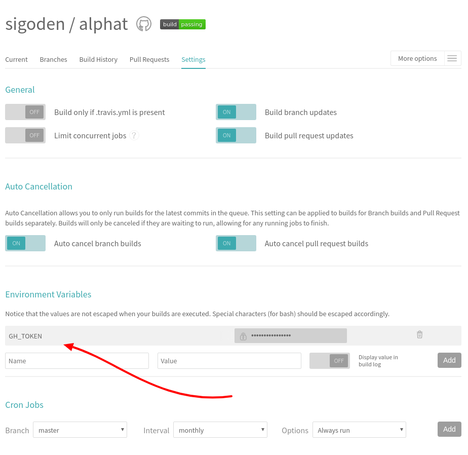

Electron 是一款可以通过 Web 技术构建跨平台桌面应用的框架。它将 Chromium 和 Node.js 的事件循环整合在一起，并提供了一些与原生系统交互的 API。

通过 Electron，我们可以使用自己所熟悉的前端技术轻松构建出一款能运行在 Windows, Linux 和 Mac 上的桌面级应用程序。已经有很多文章介绍了如何开发全平台应用，但是如何高效便捷的构建软件安装包并面向公众发布却较少被提及。本文将介绍一种简单高效的方法构建并发布安装包。

[AlphaT](https://github.com/sigoden/alphat) 是我最近使用 electron 开发的一款应用。这款应用的构建和发布中的一些经验和总结，催生了这篇博文。

简单说一下构建和发布流程：配置构建工具 [electron-builder](https://github.com/electron-userland/electron-builder), 配置 [Travis](http://www.appveyor.com/) 以构建 Linux 和 Mac 应用，配置 [AppVeyor](http://www.appveyor.com/) 以构建 Windows 应用，当提交代码到 Github 后，CI 自动拉取代码，运行 electron-builder 相关命令，生成个平台的安装包，并将安装包推送到 Github Releases 中。



仅仅进行 git 提交就能自动构建并发布，这么酷的事情一定很复杂吧？

实际上并不复杂，都只是一些简单配置而已。顺便说一句，对于开源项目，Travis 和 AppVeyor 是能够免费使用的。下面我会一步一步进行说明。

## 使用 electron-builder

electron-builder 是一款 electron 应用打包工具，简单配置就可以生成各种不同平台不同格式的安装包。支持的包有：mac 平台的 mas, dmg, pkg；win 平台的 nsis, nsisWeb, portable, appx, squirrelWindows；linux 平台的 deb, snap, appImage, pacman, rpm, freebsd, p5p, apk。同时，它还支持将构建的安装包上传到 Github Releases, Amazon S3 等服务中。从构建到发布，我们唯一剩下要做的就是正确配置。

- 安装

```
npm install electron-builder --save-dev
```

- 添加脚本

```
"postinstall": "electron-builder install-app-deps",
"dist": "electron-builder --publish onTagOrDraft"
```

其中 `postinstall` 不是必须的，只有在使用了原生模块时需要。

`--publish onTagOrDraft` 用来自动发布，详见[文档](https://github.com/electron-userland/electron-builder#cli-usage)


- 构建配置

electron 可以从 `package.json` 的 `build` 中读取配置信息

```
"build": {
  "appId": "com.sigoden.alphat",
  "mac": {
    "category": "public.app-category.utilities"
  },
  "dmg": {
    "contents": [
      {
        "x": 110,
        "y": 150
      },
      {
        "x": 240,
        "y": 150,
        "type": "link",
        "path": "/Applications"
      }
    ]
  },
  "win": {
    "target": "nsis"
  },
  "linux": {
    "category": "Utility",
    "target": [
      "deb",
      "AppImage"
    ]
  }
}
```

`mac` 和 `dmg` 将指导 electron-builder 构建适用于苹果系统的应用，`win` 指导构建 windows 应用，它表明制作安装包为 nsis 格式，`linux` 用于构建 linux 应用，它将生成安装包 deb 和 appImage。

`mac` 和 `linux` 下的 category 必须，具体有那些可选字段参考 [mac category](https://developer.apple.com/app-store/categories/) 和 [linux category](https://gist.githubusercontent.com/sigoden/d31049af934844ee4055c37fa70a843c/raw/71ddf814b0a83e9327d00892ef14586a72811f61/linux%2520application%2520category)


- 提供 icon

icon 是必须的，缺失和尺寸错误均将造成构建失败。

```
build
├── icon.icns
├── icon.ico
└── icons
    ├── 1024x1024.png
    ├── 128x128.png
    ├── 16x16.png
    ├── 24x24.png
    ├── 256x256.png
    ├── 32x32.png
    ├── 48x48.png
    ├── 512x512.png
    ├── 64x64.png
    └── 96x96.png
```

我提供了一个自动从一张 1024x1204 png 图片生成这一切的 [shell 脚本](https://gist.githubusercontent.com/sigoden/02aaf1201a43bc9257362aea090783d7/raw/79cddde8f9a410ef00d9acc21d18c48ac45a446f/makeicon)。
当然，你也可以使用在线工具如 [https://iconverticons.com/online/](https://iconverticons.com/online/)、[https://cloudconvert.com](https://cloudconvert.com) 进行 icon 转换和制作。

## 生成 GH_TOKEN

electron-builder 需要 GH_TOKEN(Github Personal access token) 才有权限上传文件到 Github Releases 中。该 Token 在 [github token 配置页面](https://github.com/settings/tokens) 中进行设置。由于我们的 CI 只需要公用仓储的访问权限，所以只需要勾选`repo > public_repo` 复选框即可。这个 token 只显示一次，需要记录下来，我们在 CI 中配置 GH_TOKEN 环境变量时要用到这个值。

## 配置 CI

你可能认为我们并不需要 CI。然而，我们需要为三种不同平台构建应用，而应用是有平台依赖的。你的 Linux 无法构建 Mac 应用，Linux 能通过 wine 构建 windows 应用，但是如此 hack 的行为你能相信构建成的应用的质量吗？正常来说是适用于特定平台的应用是需要在对应平台构建的。所以我们需要 CI，使用 AppVeyor 构建 windows 应用，使用 Travis 构建 Linux 和 Mac 应用。

### AppVeyor

这儿有一份简单（但包含需要的一切）的 `appveyor.yml`

```
platform:
  - x64

cache:
  - node_modules
  - '%APPDATA%\npm-cache'
  - '%USERPROFILE%\.electron'

install:
  - ps: Install-Product node 8 x64
  - npm install

build_script:
  - npm run dist

test: off

branches:
  only:
    - master
```

配置很简单明了，从字段名中我们看出各项参数的作用。需要注意的是 `install` 段，指定安装 node-v8-x64，然后安装包依赖。真正的构建由 `build_script` 段控制。`branches` 段表明只对 master 提交进行构建。

不要忘记配置 GH_TOKEN 环境变量。

可以直接在　`appveyor.yml` 中配置变量，　如下

```
environment:
  GH_TOKEN:
    secure: <encrypt_value>
```

其中的 `<encrypt_value>` 可以通过将 GH_TOKEN 用 AppVeyor 提供的 [工具](https://ci.appveyor.com/tools/encrypt) 加密后获得。

你也可以在项目设置中配置



配置完成。

当你提交 master 分支和 vx.xx.xx 标签到 github 时，appveyor 将自动构建 windows 安装包并发布到 Github draft release。


### Travis

Travis 的设置与 AppVeyor 类似。添加 `.travis.yml` 文件

```
osx_image: xcode8.3

dist: trusty
sudo: false

language: node_js
node_js: "8"

env:
  global:
    - ELECTRON_CACHE=$HOME/.cache/electron
    - ELECTRON_BUILDER_CACHE=$HOME/.cache/electron-builder

os:
  - linux
  - osx

cache:
  directories:
  - node_modules
  - $HOME/.cache/electron
  - $HOME/.cache/electron-builder
  - $HOME/.npm/_prebuilds

script:
  - npm run dist

branches:
  only:
    - master
```

`language` 指定 node_js,  这样我们可以就使用 node 和 npm 。`node_js` 中指定 node 版本。需要特别注意的是 `os` 段，指定 linux 和 osx，这样 Travis 能够在一次提交中同时运行两个构建，在 linux 下构建
deb 包和 appImage，在 osx 下构建 dmg 和 mac。

同时不要忘了设置 GH_TOKEN。

你可以使用 travis 命令行工具对 GH_TOKEN 进行加密

```
gem install travis

travis encrypt -r sigoden/alphat GH_TOKEN="<token>"
```

该命令会输出如下

```
secure: "<encrypted data>"
```

将 `<encrypted data>` 添加到 `.travis.yml`

```
env:
  global:
    - secure: "<encrypted data>"
```

同样你也可以在项目设置页面配置环境变量



配置完成。

当你提交 master 分支和 vx.xx.xx 标签到 github 时，travis 将自动构建 linux 和 osx 安装包当发布到 Github draft release。

## 结论

上面的介绍配置很简练的，尽管它确实能够为我们搭建了一套构建发布体系，但对于正式的商业应用，仍然有许多要调整补充的。你可能要添加原生包支持，应用签名，发布到到 Mac App Store 或 Windows Store 等方面的配置。但我相信这些都不是大问题，因为文档都有说明，而且 CI 类似虚拟机，允许安装并使用命令，本地做的工作几乎都可以在 CI 上完成。希望大家读了这篇文章后能有所收获。
