## 介绍

Gatsby 是一款基于 React 和 GraphQL 的静态文档生成器。

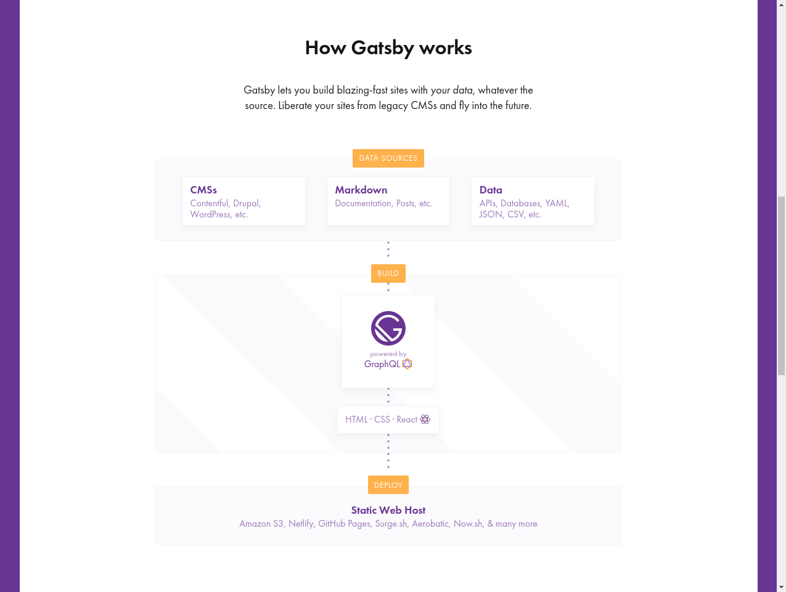

Gatsby 从各种媒介收集数据源，通过 GraphQL 暴露给前端，前端使用 React 生成界面。Gatsby 静态化整个链路，生成纯静态资源，以保证加载和渲染速度，同时也方便部署。

Gatsby 不同于传统的诸如 jekyll, hugo, hexo, ghost 静态站点生成器。这儿从零开始使用 Gatsby 搭建一个博客站点作为入门。


## 准备

安装 Gatsby 命令行工具

```
npm i -g gatsby-cli
```


使用模板初始化项目

```
gatsby new blog https://github.com/gatsbyjs/gatsby-starter-hello-world
```
该命令克隆 starter 仓储并安装 npm 包。


Gatsby 提供了开发模式，类似 webpack-dev-server。
```
cd blog
gatsby develop
```
Gatsby 会编译运行项目，终端最底部会有 `the development server is listening at:` [http://localhost:8000](http://localhost:8000). 浏览器打开该地址

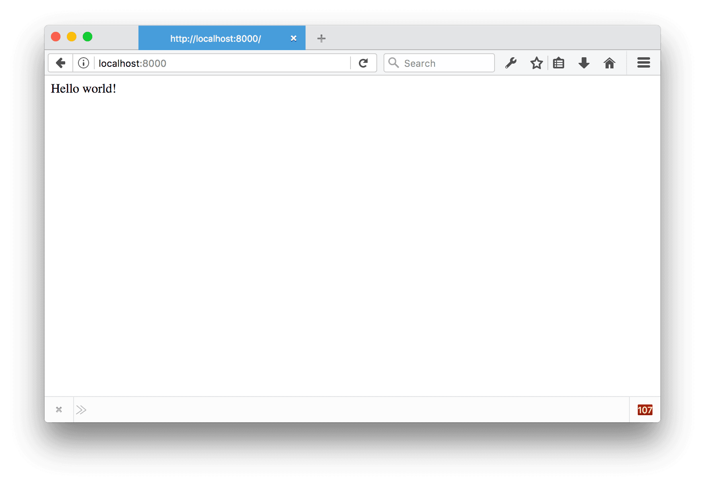


## 体验

访问　http://localhost:8000 时，Gatsby 会加载 `src/pages/index.js` 并渲染。

> src/pages 下的文件会映射成页面，如 src/pages/about.js 对应地址为 http://localhost:8000/about/ 页面。

src/pages 下的 js 文件是普通的 jsx 文件，你可以调用 React 函数，你可以安装并使用 npm 包，你可以应用包括 css, css-in-js, css modules 在内的各种 css 风格。

现在我们再建一个页面 src/pages/about.js, 并让页面支持导航，可以在 home 和 about 之间跳转。

index.js 和 about.js 代码如下

```jsx
// ./src/pages/about.js

import React from "react"
import Link from "gatsby-link"

const ListLink = props => (
  <li style={{ display: `inline-block`, marginRight: `1rem` }}>
    <Link to={props.to}>
      {props.children}
    </Link>
  </li>
)

export default () => (
  <div style={{ margin: `0 auto`, maxWidth: 650, padding: `1.25rem 1rem` }}>
    <header style={{ marginBottom: `1.5rem` }}>
      <Link to="/" style={{ textShadow: `none`, backgroundImage: `none` }}>
        <h3 style={{ display: `inline` }}>MyBlog</h3>
      </Link>
      <ul style={{ listStyle: `none`, float: `right`, margin: 0 }}>
        <ListLink to="/">Home</ListLink>
        <ListLink to="/about/">About</ListLink>
      </ul>
    </header>
    <div>
      Home Page
    </div>
  </div>
)
```

```jsx
// ./src/pages/about.js

import React from "react"
import Link from "gatsby-link"

const ListLink = props => (
  <li style={{ display: `inline-block`, marginRight: `1rem` }}>
    <Link to={props.to}>
      {props.children}
    </Link>
  </li>
)

export default () => (
  <div style={{ margin: `0 auto`, maxWidth: 650, padding: `1.25rem 1rem` }}>
    <header style={{ marginBottom: `1.5rem` }}>
      <Link to="/" style={{ textShadow: `none`, backgroundImage: `none` }}>
        <h3 style={{ display: `inline` }}>MyBlog</h3>
      </Link>
      <ul style={{ listStyle: `none`, float: `right`, margin: 0 }}>
        <ListLink to="/">Home</ListLink>
        <ListLink to="/about/">About</ListLink>
      </ul>
    </header>
    <div>
      About Page
    </div>
  </div>
)
```

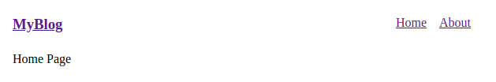

一个只有两个页面的站点就完成了，可以试试点击链接，是能够正常跳转的。


## 布局

上面的站点中，导航部分明显是通用的，它是属于布局页面的。我们这就将它抽离出来，放入合适的位置。

> src/layouts 存放布局，src/layouts/index.js 是默认布局。

```jsx
// ./src/layouts/index.js

import React from "react"
import Link from "gatsby-link"

const ListLink = props => (
  <li style={{ display: `inline-block`, marginRight: `1rem` }}>
    <Link to={props.to}>
      {props.children}
    </Link>
  </li>
)

export default ({ children }) => (
  <div style={{ margin: `0 auto`, maxWidth: 650, padding: `1.25rem 1rem` }}>
    <header style={{ marginBottom: `1.5rem` }}>
      <Link to="/" style={{ textShadow: `none`, backgroundImage: `none` }}>
        <h3 style={{ display: `inline` }}>MyBlog</h3>
      </Link>
      <ul style={{ listStyle: `none`, float: `right`, margin: 0 }}>
        <ListLink to="/">Home</ListLink>
        <ListLink to="/about/">About</ListLink>
      </ul>
    </header>
    {children()}
  </div>
)
```

> src/layouts 下的页面组件有一个 children 属性

抽出布局元素后，src/pages 下的 index.js  和 about.js 变得很简单了

```jsx
// ./src/pages/index.js

import React from "react"

export default () => (
  <div>
    Home Page
  </div>
)
```


```jsx
// ./src/pages/about.js

import React from "react"

export default () => (
  <div>
    About Page
  </div>
)
```


## GraphQL

Gatsby 基于 React 和 GraphQL。React 负责显示层，GraphQL 负责数据层。

现在我们需要在 about 页面显示邮件信息，这个信息可能变动，可能还要显示在其它页面，直接在 about 页面中写死是没发接受的，如何将数据提供给 about 页面中的 React 呢？

答案是 GraphQL。页面中需要的数据统统需要走 GraphQL 获取。

Gatsby 为我们提供了 GraphQL IDE, 访问地址是 http://localhost:8000/___graphql。

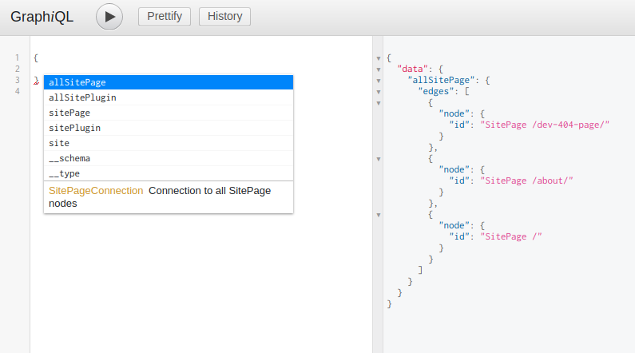

> sitePage 可供访问的页面; sitePlugin 加载的插件; site 站点配置

邮件信息应该在站点配置中。看看里面有什么?

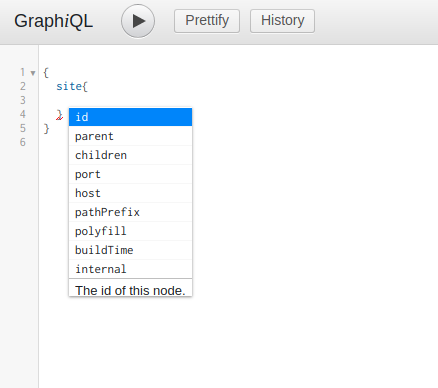

没有我们所需要的。怎样将邮件信息放入 GraphQL > site 中呢？

> Gatsby 启动时会读取项目下的 gatsby-config.js 文件，并将 siteMetadata 放入 GraphQL > site 下。

```javascript
// ./gatsby-config.js

module.exports = {
  siteMetadata: {
    mail: `gatsby@example.com`,
  },
}
```

重新运行 `gatsby develop`,  发现 GraphQL > site 下多了 `siteMetadata` 字段。

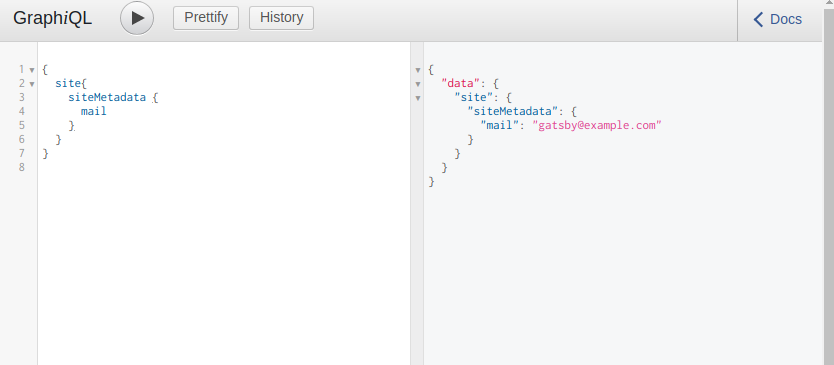

现在已经成功的将邮件信息成功的放入到 GraphQL 了，接下来我们需要在 src/pages/about.js 中获取并使用这一信息。 

```jsx
//./src/pages/about.js

import React from "react"

export default ({ data }) => (
  <div>
    About Page
    <div>
      mail: {data.site.siteMetadata.mail}
    </div>
  </div>
)

export const query = graphql`
  query AboutQuery {
    site {
      siteMetadata {
        mail
      }
    }
  }
`
```

如上，在 about.js 中添加 `graphql` 标签模板，并调用属性 data 即可。

> Gatsby 内部会通过 AST 读取 `graphql` 标签模板，请求获取并获取数据，之后将数据绑定到组件的 data 属性中。页面只需要负责解答获取哪些数据，怎样使用数据即可。


## 数据

就博客系统来说，原始数据是一批 Markdown 文件，我们需要将这批数据导入到 Gatsby 系统，使其能被页面组件以 GraphQL 查询访问。

我们使用插件 `gatsby-source-filesystem` 和 `gatsby-transformer-remark` 完成这项工作。

`gatsby-source-filesystem` 读取文件系统，并将文件和目录信息导入 GraphQL 中。 `gatsby-transformer-remark` 从文件系统信息中获取 markdown 文件信息，提取转化后导入 GraphQL 中。

准备两篇博客文章　

```markdown
// ./blogs/pandas-and-bananas.md

---
title: Pandas and Bananas
date: "2017-08-21"
---

Do Pandas eat bananas? Check out this short video that shows that yes! pandas do
seem to really enjoy bananas!
```

```markdown
// ./blogs/sweet-pandas-eating-sweets.md

---
title: "Sweet Pandas Eating Sweets"
date: "2017-08-10"
---

Pandas are really sweet.

Here's a video of a panda eating sweets.
```

其次我们需要安装插件

```
npm i -S gatsby-source-filesystem gatsby-transformer-remark
```

并在 `gatsby-config.js` 配置插件及其选项

```
// ./gatsby-config.js

module.exports = {
  siteMetadata: {
    mail: `gatsby@example.com`,
  },
  plugins: [
    {
      resolve: `gatsby-source-filesystem`,
      options: {
        name: `src`,
        path: `${__dirname}/blogs/`,
      },
    },
  ],
}
```

访问 GraphQL, 发现多了一些 Query。访问 allFile，可以获取到刚添加的博客文件信息。

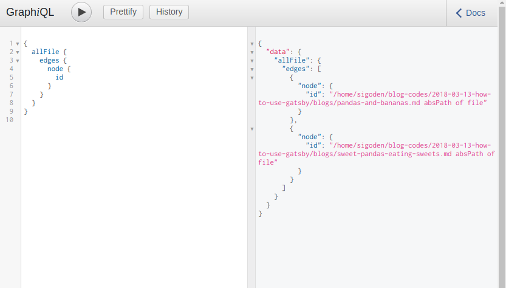

添加 `gatsby-transformer-remark`， 从文件中提取并解析 markdown 文件。

```
// ./gatsby-config.js

module.exports = {
  siteMetadata: {
    mail: `gatsby@example.com`,
  },
  plugins: [
    {
      resolve: `gatsby-source-filesystem`,
      options: {
        name: `src`,
        path: `${__dirname}/blogs/`,
      },
    },
    `gatsby-transformer-remark`,
  ],
}
```

访问 allMarkdownRemark

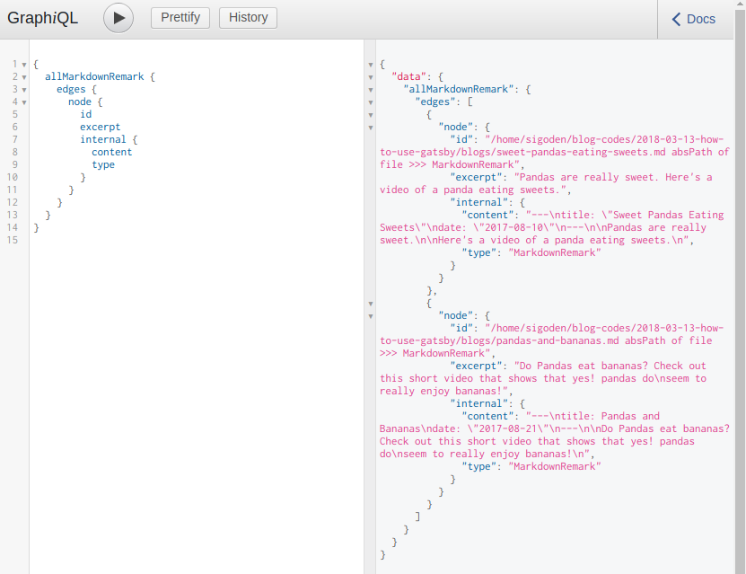

这样我们就能以 GraphQL 形式获取博客的 Markdown 文件数据。


## 节点

节点是 Gatsby 数据的基本单元，Markdown 文件在 GraphQL 中对应的节点内容如下:

```json
{
  "id": "/home/sigoden/blog-codes/2018-03-13-how-to-use-gatsby/blogs/sweet-pandas-eating-sweets.md absPath of file >>> MarkdownRemark",
  "parent": {
    "id": "/home/sigoden/blog-codes/2018-03-13-how-to-use-gatsby/blogs/sweet-pandas-eating-sweets.md absPath of file"
  },
  "children": [],
  "internal": {
    "content": "---\ntitle: \"Sweet Pandas Eating Sweets\"\ndate: \"2017-08-10\"\n---\n\nPandas are really sweet.\n\nHere's a video of a panda eating sweets.\n",
    "type": "MarkdownRemark",
    "contentDigest": "599beb9abf7899c2ea0aa891810a95b6",
    "owner": "gatsby-transformer-remark"
  },
  "frontmatter": {
    "title": "Sweet Pandas Eating Sweets",
    "date": "2017-08-10",
    "_PARENT": "/home/sigoden/blog-codes/2018-03-13-how-to-use-gatsby/blogs/sweet-pandas-eating-sweets.md absPath of file",
    "parent": "/home/sigoden/blog-codes/2018-03-13-how-to-use-gatsby/blogs/sweet-pandas-eating-sweets.md absPath of file"
  },
  "excerpt": "Pandas are really sweet. Here's a video of a panda eating sweets.",
  "fileAbsolutePath": "/home/sigoden/blog-codes/2018-03-13-how-to-use-gatsby/blogs/sweet-pandas-eating-sweets.md",
  "html": "<p>Pandas are really sweet.</p>\n<p>Here's a video of a panda eating sweets.</p>",
  "htmlAst": {
    "type": "root",
    "children": [
      {
        "type": "element",
        "tagName": "p",
        "properties": {},
        "children": [
          {
            "type": "text",
            "value": "Pandas are really sweet."
          }
        ]
      },
      {
        "type": "text",
        "value": "\n"
      },
      {
        "type": "element",
        "tagName": "p",
        "properties": {},
        "children": [
          {
            "type": "text",
            "value": "Here's a video of a panda eating sweets."
          }
        ]
      }
    ],
    "data": {
      "quirksMode": false
    }
  },
  "headings": [],
  "timeToRead": 1,
  "tableOfContents": "",
  "wordCount": {
    "paragraphs": 4,
    "sentences": 4,
    "words": 19
  }
}
```

数据还是蛮丰富的，但是我们还缺少一个字段 `slug`(对应文章链接)，我们需要一种机制，能够修改 GraphQL 的数据。

为了保证数据安全, Gatsby 的 GraphQL 只提供了查询，没有提供修改。Gatsby 提供了 Hook API 让我们可以在存储前进行修改数据。

> 在启动时，Gatsby 会加载 `gatsby-node.js` 文件，并注册或执行里面的 Hook 函数。

```
// ./gatsby-node.js

const { createFilePath } = require(`gatsby-source-filesystem`)

exports.onCreateNode = ({ node, getNode, boundActionCreators }) => {
  const { createNodeField } = boundActionCreators
  if (node.internal.type === `MarkdownRemark`) {
    const slug = createFilePath({ node, getNode, basePath: `blogs` })
    createNodeField({
      node,
      name: `slug`,
      value: slug,
    })
  }
}
```

`onCreateNode` 在添加节点后被调用，我们检测类型为 `MarkdownRemark` 的的节点，为它们添加一个 `slug` 字段，`slug` 的值通过 Markdown 文件路径生成。这样就完成了 GraphQL 数据的修改。

在 GraphiQL 中，发现节点下多了一个 `fileds` 字段，该字段下有一个 `slug` 字段。

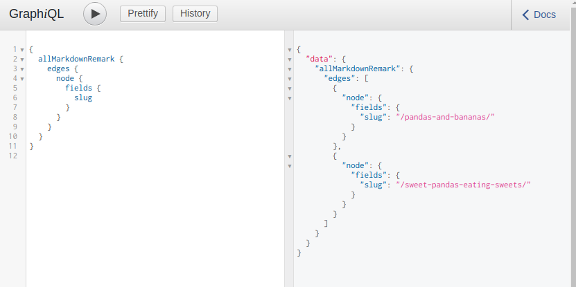


## 页面

在 Gatsby 中，节点是没有路由的，我们无法通过浏览器直接访问。我们能访问的只用页面。查询一些系统中现有的页面。

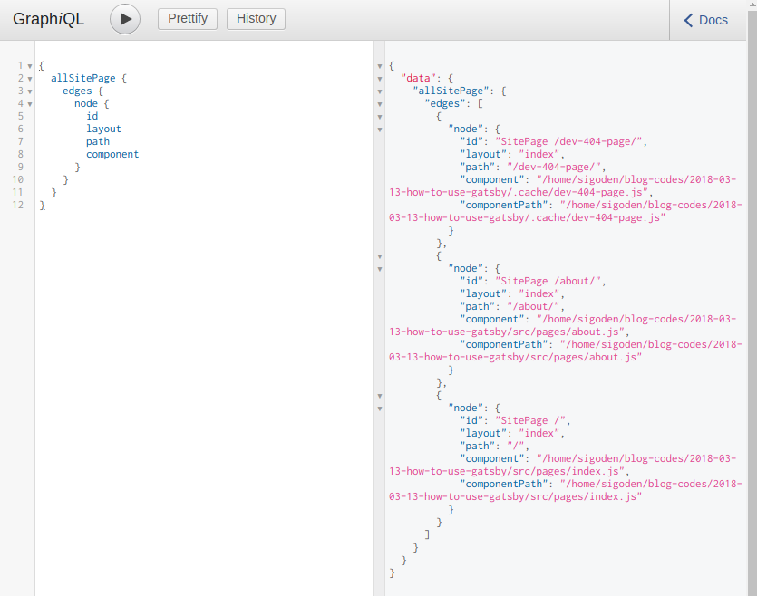

只有我们先前创建的 home 和 about，以及一个开发模式下的 404 页面。

我们需要将 MarkdownRemark 节点转换为 SitePage，以便访问。

> GraphQL 提供了 `createPages` 函数，它会在节点创建和变换完成之后调用，在该函数中我们使用 GraphQL 获取数据，再从这些数据中生成页面。

```
// ./gatsby-node.js

const path = require(`path`)
const { createFilePath } = require(`gatsby-source-filesystem`)

exports.onCreateNode = ({ node, getNode, boundActionCreators }) => {
  const { createNodeField } = boundActionCreators
  if (node.internal.type === `MarkdownRemark`) {
    const slug = createFilePath({ node, getNode, basePath: `blogs` })
    createNodeField({
      node,
      name: `slug`,
      value: slug,
    })
  }
}

exports.createPages = ({ graphql, boundActionCreators }) => {
  const { createPage } = boundActionCreators
  return new Promise((resolve, reject) => {
    graphql(`
      {
        allMarkdownRemark {
          edges {
            node {
              fields {
                slug
              }
            }
          }
        }
      }
    `
    ).then(result => {
      result.data.allMarkdownRemark.edges.forEach(({ node }) => {
        createPage({
          path: node.fields.slug,
          component: path.resolve(`./src/templates/blog-post.js`),
          context: {
            // Data passed to context is available in page queries as GraphQL variables.
            slug: node.fields.slug,
          },
        })
      })
      resolve()
    })
  })
}
```

`createPage` 函数用来创建页面。其参数
  - path: 页面的相对访问路径，以 / 开头
  - component: 模板组件绝对路径。同 pages 下的 js 一样是一个 React 组件
  - layout: 布局，默认为 `index`
  - context: 页面的上下文数据对象。会以 `props.pathContext` 的方式传递给 React 组件，也会以参数形式传递给 graphql 查询。

新建博客页面的模板 `src/templates/blog-post.js`，其内容如下:

```
// ./src/templates/blog-post.js

import React from "react"

export default ({ data }) => {
  const post = data.markdownRemark
  return (
    <div>
      <h1>{post.frontmatter.title}</h1>
      <div dangerouslySetInnerHTML={{ __html: post.html }} />
    </div>
  )
}

export const query = graphql`
  query BlogPostQuery($slug: String!) {
    markdownRemark(fields: { slug: { eq: $slug } }) {
      html
      frontmatter {
        title
      }
    }
  }
`
```

再查询一下 SitePage, 发现已生成了 Markdown 对应页面。

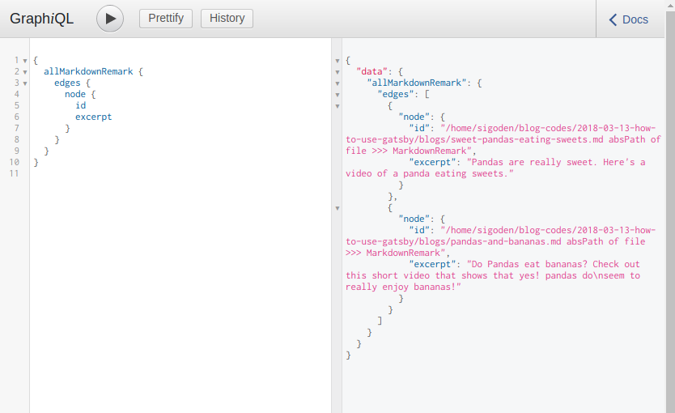

浏览器访问 http://localhost:8000/pandas-and-bananas/

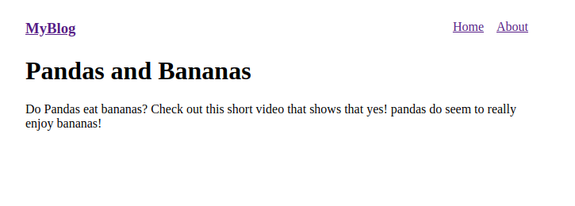

可以正确的访问博客页面了。

修改一下首页，使其显示文章列表。

```
// ./src/pages/index.js

import React from "react"
import Link from "gatsby-link"

export default ({ data }) => {
  return (
    <div>
      <h2>
        Amazing Pandas Eating Things
      </h2>
      <h4>
        {data.allMarkdownRemark.totalCount} Posts
      </h4>
      {data.allMarkdownRemark.edges.map(({ node }) =>
        <div key={node.id}>
          <Link
            to={node.fields.slug}
          >
            <h3>
              {node.frontmatter.title}{" "}
              <span>— {node.frontmatter.date}</span>
            </h3>
            <p>
              {node.excerpt}
            </p>
          </Link>
        </div>
      )}
    </div>
  )
}

export const query = graphql`
  query IndexQuery {
    allMarkdownRemark(sort: { fields: [frontmatter___date], order: DESC }) {
      totalCount
      edges {
        node {
          id
          frontmatter {
            title
            date(formatString: "DD MMMM, YYYY")
          }
          fields {
            slug
          }
          excerpt
        }
      }
    }
  }
`
```

博客系统到此完成了。


为了方便演示，这里只实现了基本功能，css，标签，翻页等就此略去。


## 发布 

Gatsby 是静态站点生成器，现在这种前后台的交互只存在开发模式下，在部署到生产环境前，我们可以就整个站点编译成一批静态资源，方便部署到静态站点伺服器上。

这个操作只需要运行一个命令即可完成

```
gatsby build
```

生成的数据位于项目的 `public` 文件夹下。

## 结语

从整个博客的创建过程可以看到，Gatsby 在功能上是很强大灵活的，而使用上又不失简单方便。数据源方面可以接入 redis, mongo, mysql 等数据库系统，可以接入 medium, wordpress 等现成的博客和 CMS 系统，具体有哪些可以看看官方提供的插件，如果没有，你也可以自己贡献插件。不管是何种数据，只要能导入到 GraphQL 节点，Gatsby 就能使用。界面方面使用 React，功能和灵活性上的强大不言而喻。以 GraphQL 作为这两者的桥接简直是画龙点睛。
